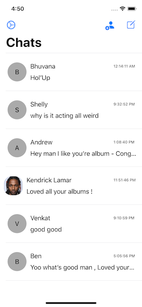

# My FlashChat

I developed a real-time chat app that allows users to add friends and lets them chat with their friends!

Cocapods used:
* Firebase/Firestore
* Auto-Animated Labels

The app has the following features:
* Create and Login a user with their email ID using Firebase authentication 
* Allows the users to add friends to their friends list !
* Real-time chat with their friends 
* Allows the users to udpate their details (like profile picture , email ID , etc.)

Things to see in V2 (IN-Progress):
* Better UI/UX Design 
* allow users to upload stories (like IG Stories);

